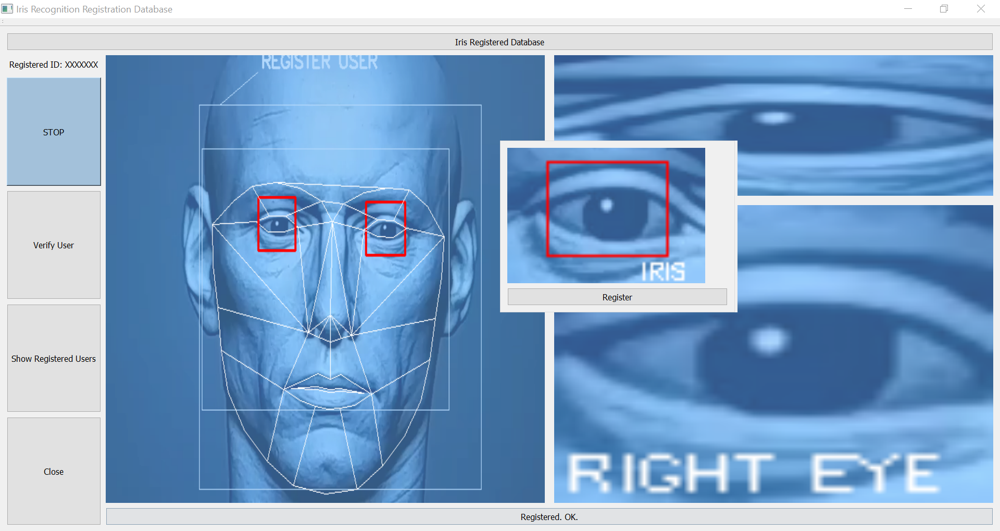
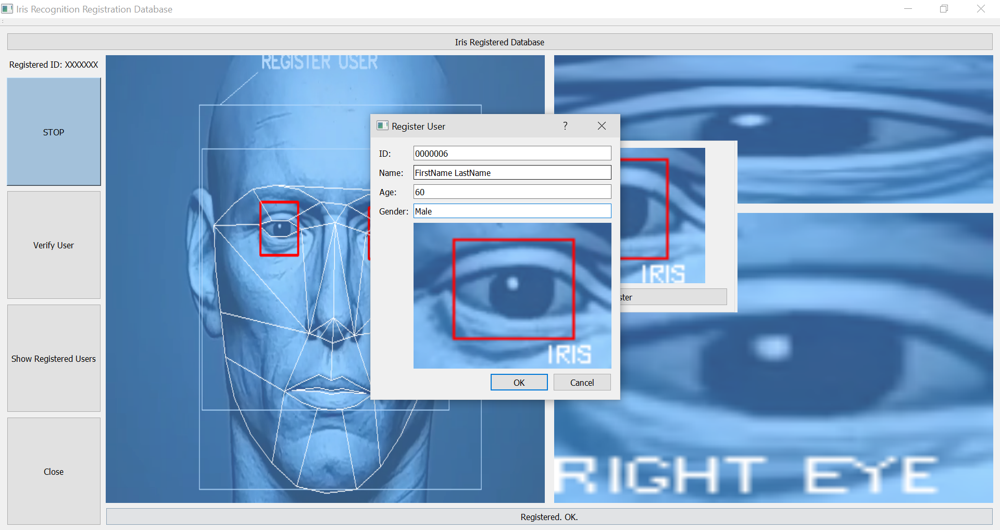
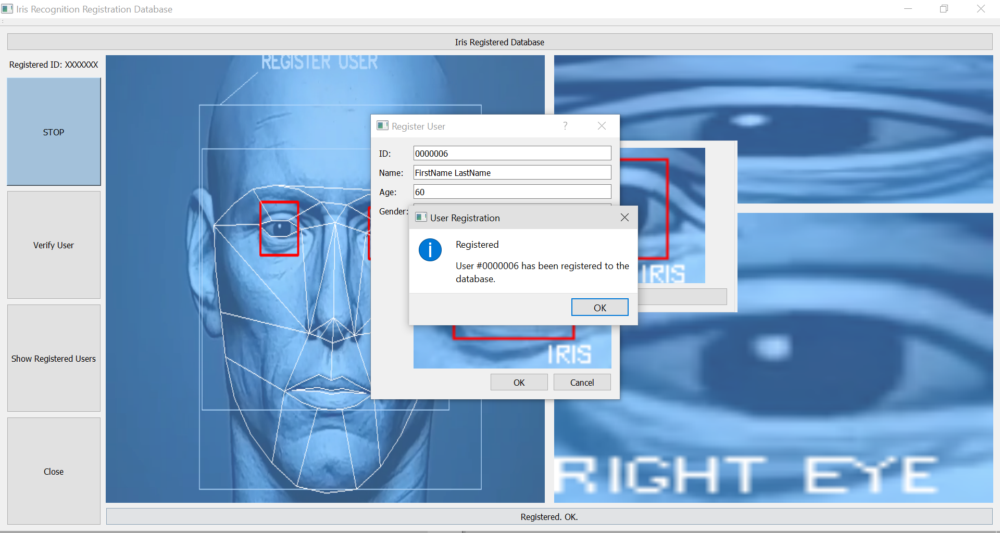
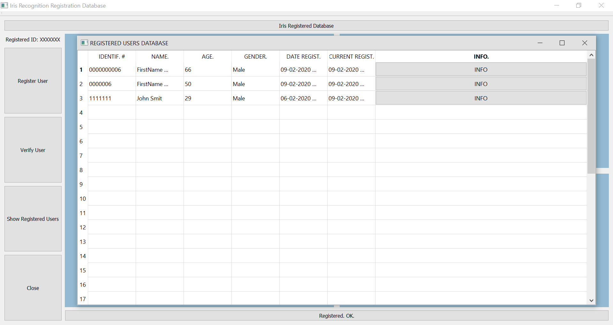
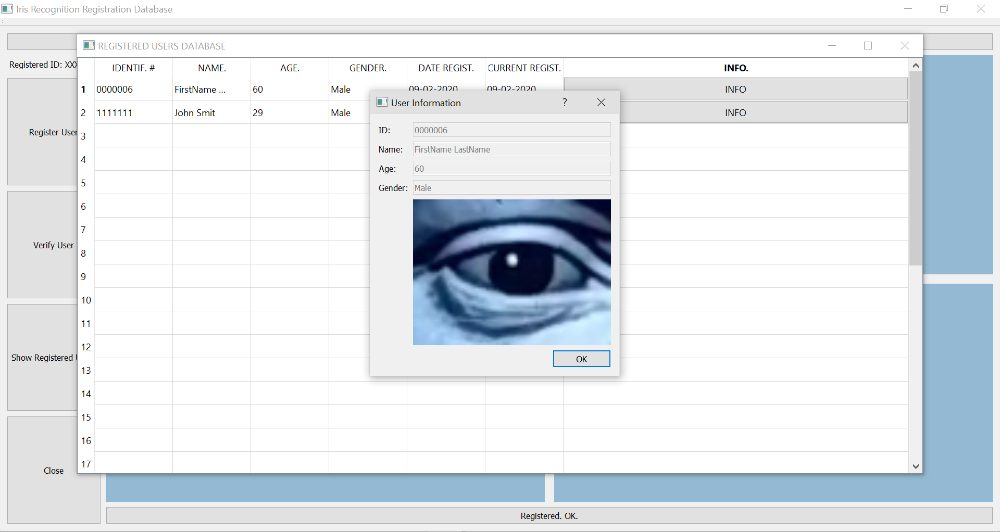

# Iris-Recognition-Registration-Database-System

A Iris Recognition Registration Database System, that uses computer vision technology to do facial recognition to capture the IRIS of an individual, and store their information in a database. The DLIB library is used to detect and recognize the face structure, and pinpoint the eyes, openCV then captures the eyes through its video capturing functions, and stores it into an image along with input from the user. During verification an associated ID inputted by the user is entered when verifying the IRIS. The IRIS is captured through the video feed and sent to a pattern feature-like matching system setup using ORB's detector. The detector does pattern matching of both the user's IRIS through the feed, and the stored image of the user's IRIS using keypoints, and tests for a match using a matching ratio value assigned by the program.

<h2>Installation: Setting Up Python 3.X with OpenCV and External Libraries:</h2>

<strong>1. Download python 3 here, in this case it was python-3.6.4-amd64 for windows:</strong>
https://www.python.org/downloads/release/python-364/

<strong> 2. To install python libraries on windows: </strong>
<ul>
 	<li> Open up installation directory and run cmd on directory. 	</li>
 	<li> cd D:\Python3\Scripts 	</li>
 	<li> cmd on toolbar 	</li>
 	<li> pip install [LibraryName] 	</li>
</ul>

<strong> 3. Install the following libraries: </strong>
<ul>
 	<li> OpenCV (pip3 install opencv-python) 	</li>
 	<li> numpy (pip install numpy) 	</li>
 	<li> Pillow (pip install pillow) 	</li>
 	<li> PyQT5 (pip install pyqt5) 	</li>
 	<li> CMAKE (pip install cmake - this is required to install dlib) 	</li>
 	<li> DLIB (pip install dlib) 	</li>
 	<li> DateTime (pip install datetime) 	</li>
 <li> <b>(X) SIFT (pip install opencv-contrib-python) - REMOVED, the library is patented so its no longer used for Iris Matching but opencv-contrib-python has other useful libraries so its worth installing
	</b> </li>
</ul>

<strong> To generate gui file as python: </strong>
<ul>
 	<li> navigate to folder of gui file and type cmd </li>
 	<li> in command terminal type the following: 	</li>
</ul>

	
 	pyuic5 -x guiIRRDN.ui -o guiIRRD.py
	pyuic5 -x guiIPopUp.ui -o guiIPopUp.py
	

  <b> Registering the IRIS:  </b>

Once the register button is pressed, the program will halt and open a prompt asking for user input. The input is stored along with the image. The captured IRIS portfolios are stored under the database folder.

  <b> Viewing Registered Users in the Database:  </b>

All users registered with the system can be viewed using the "show registered users" button. This will open up a table of all registered users with each cell corresponding to the inputted data from the individual users registered. The IRIS registered by each user can also be viewed by pressing the "INFO" button configured in the cell of the table.

<strong> Python Editor Used:  </strong>
<ul>
 	<li> IDLE </li>
</ul>

<strong> Platform Test:  </strong>
<ul>
 	<li> Windows </li>
</ul>

<strong> Equipment: </strong>
<ul>
 	<li> Laptop running program </li>
 	<li> High Definition camera (or mobile phone/device running camera through an RTSP server) 	</li>
</ul>

